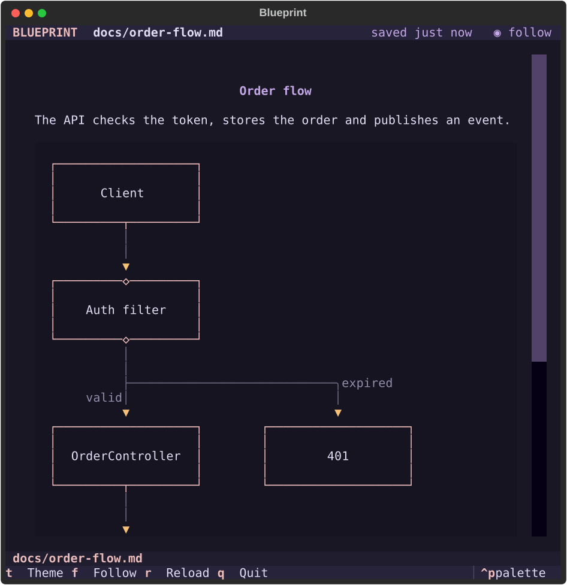
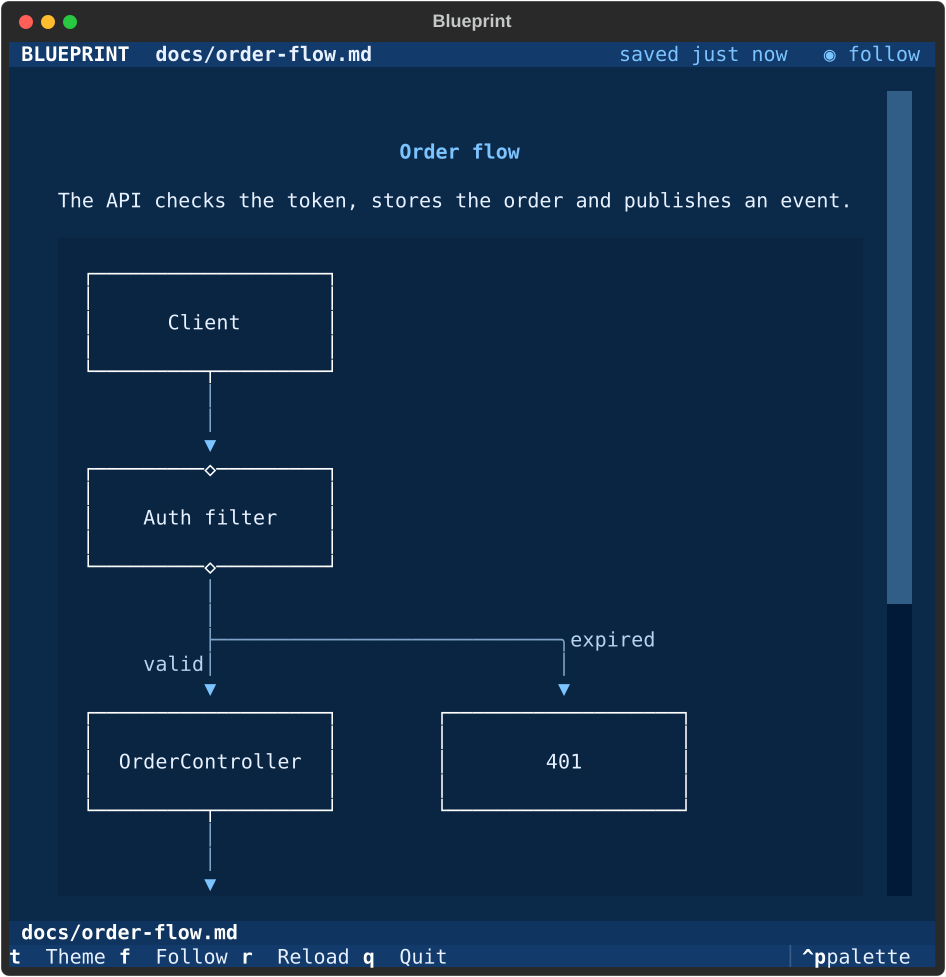
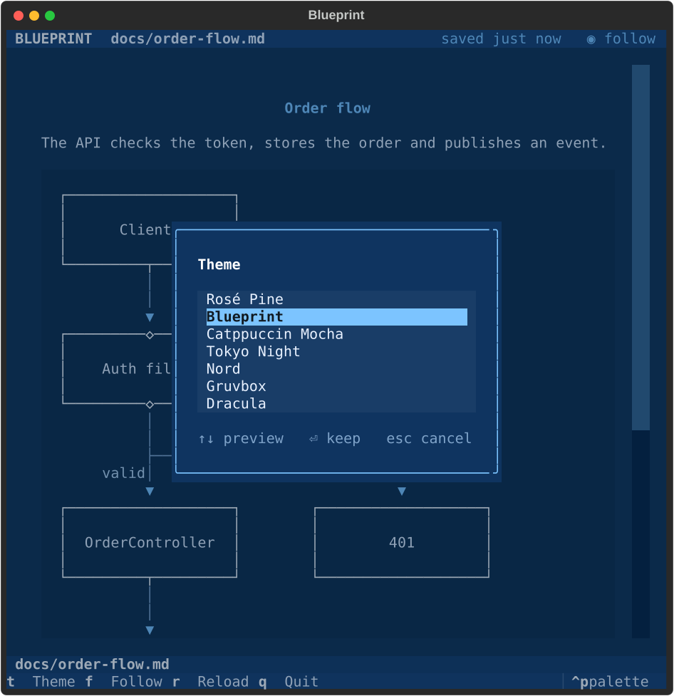

# Blueprint

Live Markdown and Mermaid for your agent's side pane.

<p align="center">
  
  
</p>

Blueprint is a [herdr](https://herdr.dev) plugin. Put it next to your coding
agent and it shows one thing: the latest doc or diagram the agent sent, drawn
in your terminal with colors that match your theme.

- **One screen.** Each send replaces what is shown. Nothing piles up.
- **Draw on request.** Mermaid is drawn with [termaid](https://github.com/fasouto/termaid)
  when the sender adds `--draw`; otherwise it stays as clean text.
- **Refresh on request.** The agent (or `r`) redraws what is on screen.
- **Themes.** Press `t` to pick a theme. Only your theme is saved.
- **Runs everywhere.** macOS, Linux and Windows. No browser, no images.

## Install

You need [uv](https://docs.astral.sh/uv/) and herdr 0.9.3 or newer.

```bash
herdr plugin install chappse6/herdr-blueprint
herdr plugin action invoke seeun.blueprint.open
```

Bind it to a key in `~/.config/herdr/config.toml`:

```toml
[[keys.command]]
key = "prefix+alt+b"
type = "plugin_action"
command = "seeun.blueprint.open"
description = "open Blueprint"
```

## Keys

| Key | Action |
|---|---|
| `t` | Change theme |
| `r` | Reload |
| `q` | Quit |

## Send things from an agent

```bash
herdr-blueprint show docs/design.md               # a file
printf 'graph LR\n  A --> B\n' | herdr-blueprint send --draw --title "Flow"
herdr-blueprint refresh --draw                    # redraw what is shown
```

`--draw` makes Blueprint draw Mermaid. Without it, diagrams show as text, which
is faster. Each send or refresh carries its own flag.

The command lives in the plugin's own environment. From an agent, run it
through the plugin folder:

```bash
root=$(herdr plugin list --json | jq -r '.result.plugins[] | select(.plugin_id == "seeun.blueprint") | .plugin_root')
uv run --project "$root" --no-sync herdr-blueprint send --draw --title "Flow" < flow.mmd
```

Teach Claude Code and Codex to send diagrams on their own:

    herdr plugin action invoke seeun.blueprint.install-skill

This links `skills/blueprint` into `~/.claude/skills` and `~/.agents/skills`
(a copy on Windows when symlinks are not allowed). Start a new agent session
to pick it up. Undo with `herdr-blueprint uninstall-skill`.

## Themes

Rosé Pine (default), Blueprint, Catppuccin Mocha, Tokyo Night, Nord, Gruvbox
and Dracula. Your choice is saved.



## Development

```bash
uv sync
uv run pytest
uv run herdr-blueprint            # run outside herdr
herdr plugin link "$PWD"          # use this folder as the plugin
```

## Credits

Blueprint stands on these MIT-licensed projects:

- [termaid](https://github.com/fasouto/termaid) by Fabio Souto: Mermaid in the terminal
- [Textual](https://github.com/Textualize/textual) and [Rich](https://github.com/Textualize/rich) by Will McGugan and Textualize
- [watchfiles](https://github.com/samuelcolvin/watchfiles) by Samuel Colvin
- [platformdirs](https://github.com/tox-dev/platformdirs)

## License

MIT
