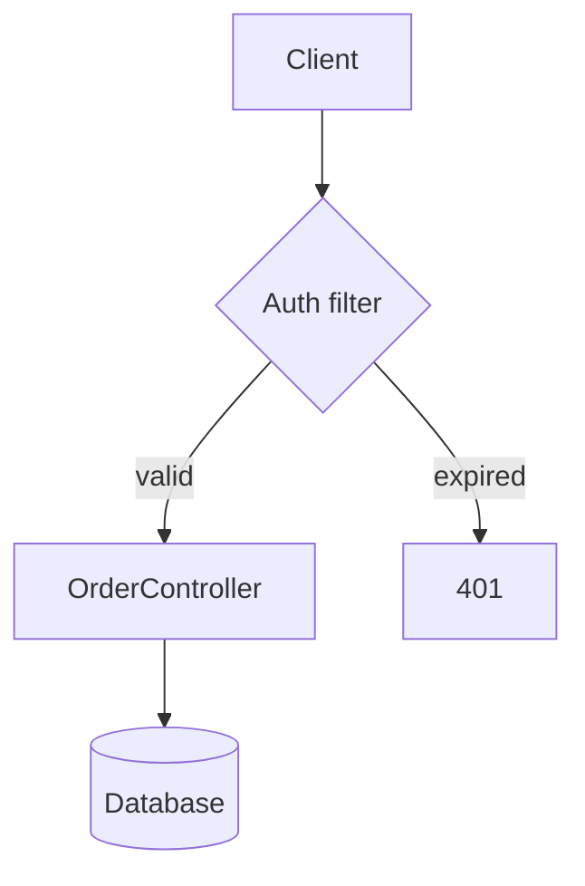

# Blueprint v0.2 Implementation Plan

> **For agentic workers:** REQUIRED SUB-SKILL: Use superpowers:subagent-driven-development (recommended) or superpowers:executing-plans to implement this plan task-by-task. Steps use checkbox (`- [ ]`) syntax for tracking.

**Goal:** Take the working Blueprint skeleton to a publishable v0.2: robust against odd files and racing viewers, opened correctly from herdr, agent skill installable, visual regression tests, README screenshots, and green CI on macOS, Linux and Windows.

**Architecture:** The skeleton already has the final module layout (`app`, `document`, `diagram`, `themes`, `history`, `config`, `sources/follow`, `sources/inbox`, `cli`). This plan hardens those modules, adds one module (`skills_install.py`), and adds snapshot tests and a screenshot script. No module changes its responsibility.

**Tech Stack:** Python 3.10+, uv (managed Python only), Textual 8, termaid 0.9 (rich extra), watchfiles, platformdirs, pytest, pytest-asyncio, pytest-textual-snapshot.

**Spec:** `docs/design/specs/2026-10-09-blueprint-design.md`

## Global Constraints

- `requires-python = ">=3.10"`; `[tool.uv] python-preference = "only-managed"`.
- termaid pinned `>=0.9,<0.10` (Blueprint writes into termaid's internal theme table).
- No bash in any herdr command. Every manifest command starts with `uv`.
- Paths use `pathlib`; config/state folders come from `platformdirs`; file watching uses `watchfiles`; agent push uses files, not sockets.
- Plugin id `seeun.blueprint`; CLI command `herdr-blueprint`; package `herdr_blueprint`.
- Simple English in UI text, docs, code and commit messages.
- MIT license; keep the README credits for termaid, Textual, Rich, watchfiles, platformdirs.
- Run tests with `uv run pytest -q` from the repo root (`~/Desktop/work/project/herdr/blueprint`).
- Ask the user before any outward action: creating the GitHub repo, pushing, or posting upstream issues.

## Review Focus

1. A `.md` file with invalid UTF-8 or binary bytes: the viewer shows it with replacement characters and never crashes. → Task 1
2. A very large Markdown file (generated docs, logs over 1 MB): the first 1,000,000 bytes show with a notice and the UI stays responsive. → Task 1
3. The followed or history file is deleted or renamed before it is read: a warning appears in the header and the previous content stays. → Task 1
4. Two Blueprint viewers open in one workspace: each agent push appears in exactly one viewer. → Task 2
5. An agent sends `draw` before the viewer opens, or the viewer opens much later: messages up to 1 hour old appear on start; older ones are dropped. → Task 2

---

### Task 1: Safe file reading and header notices

**Files:**
- Modify: `src/herdr_blueprint/history.py` (`Item.read`, new `MAX_BYTES`)
- Modify: `src/herdr_blueprint/app.py` (`ago`, `__init__`, `on_mount`, `open_item`, `_update_status`)
- Test: `tests/test_history.py`, `tests/test_app.py`

**Interfaces:**
- Consumes: `Item`, `History` (existing).
- Produces: `history.MAX_BYTES: int = 1_000_000`; `Item.read() -> str` never raises `UnicodeDecodeError`; `app.ago(at: float, now: float | None = None) -> str`; `BlueprintApp.notice: str | None`.

- [ ] **Step 1: Write the failing tests**

Add to `tests/test_history.py`:

```python
def test_read_replaces_bad_bytes(tmp_path):
    doc = tmp_path / "bad.md"
    doc.write_bytes(b"# Title \xff\xfe end")
    text = Item(kind="file", title="bad.md", path=doc).read()
    assert text.startswith("# Title ")
    assert "�" in text


def test_read_cuts_large_documents_with_notice(tmp_path, monkeypatch):
    monkeypatch.setattr("herdr_blueprint.history.MAX_BYTES", 10)
    doc = tmp_path / "big.md"
    doc.write_text("a" * 50, encoding="utf-8")
    text = Item(kind="file", title="big.md", path=doc).read()
    assert text.startswith("a" * 10)
    assert "a" * 11 not in text
    assert "This file is large" in text


def test_read_cuts_large_diagrams_without_notice(tmp_path, monkeypatch):
    monkeypatch.setattr("herdr_blueprint.history.MAX_BYTES", 10)
    diagram = tmp_path / "big.mmd"
    diagram.write_text("b" * 50, encoding="utf-8")
    assert Item(kind="file", title="big.mmd", path=diagram).read() == "b" * 10
```

Add to `tests/test_app.py`:

```python
from herdr_blueprint.app import ago
from herdr_blueprint.history import Item


def test_ago_formats_relative_time():
    assert ago(100, now=130) == "just now"
    assert ago(100, now=100 + 120) == "2m ago"
    assert ago(100, now=100 + 7200) == "2h ago"


async def test_missing_file_shows_notice_and_keeps_content(tmp_path):
    app = make_app(tmp_path)
    async with app.run_test(size=(80, 40)) as pilot:
        await pilot.pause()
        await app.open_item(Item(kind="file", title="gone.md", path=tmp_path / "gone.md"))
        assert "Cannot read gone.md" in str(app.query_one("#status").render())
        assert app.query(DocumentView)


async def test_notice_clears_after_a_good_file(tmp_path):
    good = tmp_path / "good.md"
    good.write_text("# Good", encoding="utf-8")
    app = make_app(tmp_path)
    async with app.run_test(size=(80, 40)) as pilot:
        await pilot.pause()
        await app.open_item(Item(kind="file", title="gone.md", path=tmp_path / "gone.md"))
        await app.open_item(Item(kind="file", title="good.md", path=good))
        assert app.notice is None
        assert "Cannot read" not in str(app.query_one("#status").render())
```

- [ ] **Step 2: Run the tests to verify they fail**

Run: `uv run pytest tests/test_history.py tests/test_app.py -q`
Expected: FAIL. `test_read_replaces_bad_bytes` raises `UnicodeDecodeError`; `test_ago_formats_relative_time` fails with `TypeError: ago() got an unexpected keyword argument 'now'`; the notice tests fail on the missing `notice` attribute or text.

- [ ] **Step 3: Implement `Item.read` limits**

In `src/herdr_blueprint/history.py`, add below `VIEWABLE_SUFFIXES`:

```python
# Larger files are cut so a huge generated doc can't freeze the viewer.
MAX_BYTES = 1_000_000
```

Replace `Item.read` with:

```python
    def read(self) -> str:
        """Text to render. Raises OSError when a file cannot be read.

        Bad bytes become U+FFFD and long files are cut, so odd files never
        crash the viewer. Documents get a notice; diagrams stay valid Mermaid.
        """
        if self.kind == "mermaid":
            return self.source or ""
        assert self.path is not None
        with self.path.open("rb") as handle:
            data = handle.read(MAX_BYTES + 1)
        text = data[:MAX_BYTES].decode("utf-8", errors="replace")
        if len(data) > MAX_BYTES and not self.is_diagram:
            text += f"\n\n> This file is large. Showing the first {MAX_BYTES:,} bytes.\n"
        return text
```

- [ ] **Step 4: Implement header notices and the live clock**

In `src/herdr_blueprint/app.py`, replace `ago` with:

```python
def ago(at: float, now: float | None = None) -> str:
    seconds = max(0, int((time.time() if now is None else now) - at))
    if seconds < 60:
        return "just now"
    if seconds < 3600:
        return f"{seconds // 60}m ago"
    return f"{seconds // 3600}h ago"
```

In `BlueprintApp.__init__`, after `self.history = History()`, add:

```python
        self.notice: str | None = None
```

At the end of `on_mount`, add:

```python
        self.set_interval(30, self._update_status)
```

Replace `open_item` with:

```python
    async def open_item(self, item: Item | None) -> None:
        if item is None:
            return
        try:
            text = item.read()
        except OSError:
            # Keep the last content on screen; say what went wrong in the header.
            self.notice = f"Cannot read {item.title}"
            self._update_status()
            return
        self.notice = None
        await self._render_text(text, diagram=item.is_diagram)
        self.query_one("#source", Static).update(item.title)
        self._update_status()
        self._update_tabs()
```

Replace `_update_status` with:

```python
    def _update_status(self) -> None:
        palette = palette_for_theme(self.theme)
        item = self.history.current
        status = Text()
        if self.notice:
            status.append(f"⚠ {self.notice}   ", style=f"bold {palette.warning}")
        elif item:
            origin = "saved" if item.sent_by == "follow" else f"from {item.sent_by}"
            status.append(f"{origin} {ago(item.at)}   ")
        status.append("◉ follow" if self.following else "○ paused")
        self.query_one("#status", Static).update(status)
```

- [ ] **Step 5: Run all tests**

Run: `uv run pytest -q`
Expected: all pass.

- [ ] **Step 6: Commit**

```bash
git add src/herdr_blueprint/history.py src/herdr_blueprint/app.py tests/test_history.py tests/test_app.py
git commit -m "Handle odd and missing files without crashing

Bad bytes render as U+FFFD, files over 1 MB are cut with a notice, and a
file that can't be read leaves the last content on screen with a header
warning. The header time now refreshes every 30 seconds."
```

---

### Task 2: Inbox claims, expiry and logging

**Files:**
- Modify: `src/herdr_blueprint/sources/inbox.py` (`receive`, new `MAX_AGE_SECONDS`, logger)
- Test: `tests/test_inbox.py`

**Interfaces:**
- Consumes: `Item` (existing), `send`, `inbox_dir`, `watch_inbox` (existing).
- Produces: `inbox.MAX_AGE_SECONDS: int = 3600`; `receive(path: Path, now: float | None = None) -> Item | None` claims the file with a rename, so only one caller gets a message.

- [ ] **Step 1: Write the failing tests**

Add to `tests/test_inbox.py`:

```python
import time


def test_a_message_is_received_only_once():
    path = inbox.send({"kind": "mermaid", "source": "graph LR\n  A --> B"})
    assert inbox.receive(path) is not None
    assert inbox.receive(path) is None


def test_old_messages_are_dropped():
    path = inbox.send({"kind": "mermaid", "source": "graph LR\n  A --> B", "sent_at": 1000})
    assert inbox.receive(path, now=1000 + inbox.MAX_AGE_SECONDS + 1) is None
    assert not path.exists()


def test_recent_messages_are_kept():
    path = inbox.send({"kind": "mermaid", "source": "graph LR\n  A --> B", "sent_at": 1000})
    assert inbox.receive(path, now=1000 + 60) is not None


def test_bad_sent_at_is_treated_as_now():
    path = inbox.send({"kind": "mermaid", "source": "graph LR\n  A --> B", "sent_at": "soon"})
    item = inbox.receive(path)
    assert item is not None
    assert abs(item.at - time.time()) < 5


def test_skipped_messages_are_logged(caplog):
    folder = inbox.inbox_dir()
    folder.mkdir(parents=True)
    bad = folder / "1-bad.json"
    bad.write_text("{not json", encoding="utf-8")
    with caplog.at_level("WARNING", logger="herdr_blueprint.inbox"):
        inbox.receive(bad)
    assert "1-bad.json" in caplog.text


async def test_messages_sent_before_start_are_delivered():
    inbox.send({"kind": "mermaid", "source": "graph LR\n  A --> B", "title": "Early"})
    messages = inbox.watch_inbox()
    item = await anext(messages)
    await messages.aclose()
    assert item.title == "Early"
```

- [ ] **Step 2: Run the tests to verify they fail**

Run: `uv run pytest tests/test_inbox.py -q`
Expected: FAIL in `test_old_messages_are_dropped` and `test_recent_messages_are_kept` (`TypeError: receive() got an unexpected keyword argument 'now'`), `test_bad_sent_at_is_treated_as_now` (`ValueError: could not convert string to float`) and `test_skipped_messages_are_logged` (empty log). `test_a_message_is_received_only_once` and `test_messages_sent_before_start_are_delivered` may already pass; they guard the new claim logic.

- [ ] **Step 3: Implement claim, expiry and logging**

In `src/herdr_blueprint/sources/inbox.py`, add `import logging` to the imports, and below the imports add:

```python
log = logging.getLogger("herdr_blueprint.inbox")

# Messages older than this are dropped, so yesterday's diagram doesn't pop up today.
MAX_AGE_SECONDS = 3600
```

Replace `receive` with:

```python
def _sent_at(data: dict, now: float) -> float:
    try:
        return float(data.get("sent_at", now))
    except (TypeError, ValueError):
        return now


def receive(path: Path, now: float | None = None) -> Item | None:
    """Claim, read and delete one message.

    The claim is a rename, so when two viewers race only one gets the message.
    Broken, unknown and expired messages are dropped and logged.
    """
    now = time.time() if now is None else now
    claimed = path.with_name(f".{path.name}.{os.getpid()}.claimed")
    try:
        os.replace(path, claimed)
    except OSError:
        return None  # another viewer took it first
    try:
        data = json.loads(claimed.read_text(encoding="utf-8"))
    except (OSError, ValueError):
        data = None
    finally:
        claimed.unlink(missing_ok=True)
    if not isinstance(data, dict):
        log.warning("Skipped broken message %s", path.name)
        return None
    at = _sent_at(data, now)
    if now - at > MAX_AGE_SECONDS:
        log.info("Skipped old message %s", path.name)
        return None
    sent_by = str(data.get("sent_by", "agent"))
    if data.get("kind") == "file" and data.get("path"):
        file = Path(data["path"])
        return Item(kind="file", title=file.name, path=file, sent_by=sent_by, at=at)
    if data.get("kind") == "mermaid" and data.get("source"):
        title = str(data.get("title") or "Diagram")
        return Item(kind="mermaid", title=title, source=str(data["source"]), sent_by=sent_by, at=at)
    log.warning("Skipped unknown message %s", path.name)
    return None
```

- [ ] **Step 4: Run all tests**

Run: `uv run pytest -q`
Expected: all pass. `test_broken_message_is_skipped_and_deleted` and `test_send_leaves_no_temp_files` still pass because claimed files start with `.` and are always deleted.

- [ ] **Step 5: Commit**

```bash
git add src/herdr_blueprint/sources/inbox.py tests/test_inbox.py
git commit -m "Claim inbox messages so only one viewer shows each

A message is claimed with an atomic rename before reading. Messages older
than an hour are dropped, and skipped messages are logged."
```

---

### Task 3: Open the viewer next to the agent pane

**Files:**
- Modify: `src/herdr_blueprint/cli.py` (`ROOT_ENV`, `detect_root`, new `focused_pane`, new `open_command`, `open` branch of `main`)
- Modify: `docs/design/specs/2026-10-09-blueprint-design.md` (workspace root order)
- Test: `tests/test_cli.py`

**Interfaces:**
- Consumes: `PLUGIN_ID` (existing).
- Produces: `cli.ROOT_ENV = "HERDR_BLUEPRINT_ROOT"`; `focused_pane(herdr: str, pane_id: str | None, run=subprocess.run) -> tuple[str | None, Path | None]`; `open_command(herdr: str, pane_id: str | None, root: Path | None) -> list[str]`.

Why: herdr starts plugin panes in the plugin folder, so the viewer must be told the workspace folder. The `open` action reads the focused pane's folder and passes it as `HERDR_BLUEPRINT_ROOT` with `--env`, and opens the pane to the right without stealing focus.

- [ ] **Step 1: Write the failing tests**

Add to `tests/test_cli.py`:

```python
import subprocess


def completed(stdout: str, code: int = 0):
    return lambda cmd, **kwargs: subprocess.CompletedProcess(cmd, code, stdout=stdout, stderr="")


def test_open_command_targets_pane_and_passes_root(tmp_path):
    cmd = cli.open_command("herdr", "w1:p1", tmp_path)
    assert cmd[:4] == ["herdr", "plugin", "pane", "open"]
    assert cmd[cmd.index("--placement") + 1] == "split"
    assert cmd[cmd.index("--direction") + 1] == "right"
    assert cmd[cmd.index("--target-pane") + 1] == "w1:p1"
    assert cmd[cmd.index("--env") + 1] == f"HERDR_BLUEPRINT_ROOT={tmp_path}"
    assert "--no-focus" in cmd


def test_open_command_without_pane_or_root():
    cmd = cli.open_command("herdr", None, None)
    assert "--target-pane" not in cmd
    assert "--env" not in cmd


def test_focused_pane_reads_foreground_cwd(tmp_path):
    out = json.dumps({"result": {"pane": {"pane_id": "w1:p1", "cwd": "/nope", "foreground_cwd": str(tmp_path)}}})
    assert cli.focused_pane("herdr", None, run=completed(out)) == ("w1:p1", tmp_path)


def test_focused_pane_survives_herdr_errors():
    assert cli.focused_pane("herdr", "w1:p1", run=completed("", code=1)) == ("w1:p1", None)
    assert cli.focused_pane("herdr", "w1:p1", run=completed("not json")) == ("w1:p1", None)


def test_focused_pane_survives_missing_herdr():
    def missing(cmd, **kwargs):
        raise FileNotFoundError(cmd[0])

    assert cli.focused_pane("herdr", None, run=missing) == (None, None)


def test_detect_root_prefers_env(tmp_path, monkeypatch):
    monkeypatch.setenv("HERDR_BLUEPRINT_ROOT", str(tmp_path))
    monkeypatch.setenv("HERDR_PLUGIN_CONTEXT_JSON", json.dumps({"cwd": "/"}))
    assert cli.detect_root() == tmp_path
```

- [ ] **Step 2: Run the tests to verify they fail**

Run: `uv run pytest tests/test_cli.py -q`
Expected: FAIL with `AttributeError: module 'herdr_blueprint.cli' has no attribute 'open_command'` (and `focused_pane`); `test_detect_root_prefers_env` returns `/`.

- [ ] **Step 3: Implement root env, `focused_pane` and `open_command`**

In `src/herdr_blueprint/cli.py`, below `PLUGIN_ID`, add:

```python
# The open action passes the workspace folder to the viewer pane in this variable.
ROOT_ENV = "HERDR_BLUEPRINT_ROOT"
```

At the top of `detect_root`, before the context lookup, add:

```python
    env_root = os.environ.get(ROOT_ENV)
    if env_root and Path(env_root).is_dir():
        return Path(env_root)
```

and change its docstring to:

```python
    """Workspace folder: HERDR_BLUEPRINT_ROOT, then the herdr plugin context, then cwd."""
```

Add these functions below `_find_key`:

```python
def focused_pane(herdr: str, pane_id: str | None, run=subprocess.run) -> tuple[str | None, Path | None]:
    """Pane id and folder of `pane_id`, or of the focused pane when it is None."""
    cmd = [herdr, "pane", "get", pane_id] if pane_id else [herdr, "pane", "current"]
    try:
        result = run(cmd, capture_output=True, text=True)
    except OSError:
        return pane_id, None
    if result.returncode != 0:
        return pane_id, None
    try:
        pane = json.loads(result.stdout)["result"]["pane"]
    except (ValueError, KeyError, TypeError):
        return pane_id, None
    for key in ("foreground_cwd", "cwd"):
        folder = pane.get(key)
        if folder and Path(folder).is_dir():
            return pane.get("pane_id", pane_id), Path(folder)
    return pane.get("pane_id", pane_id), None


def open_command(herdr: str, pane_id: str | None, root: Path | None) -> list[str]:
    """herdr command that opens the viewer to the right without moving focus."""
    cmd = [
        herdr, "plugin", "pane", "open",
        "--plugin", PLUGIN_ID, "--entrypoint", "viewer",
        "--placement", "split", "--direction", "right", "--no-focus",
    ]
    if pane_id:
        cmd += ["--target-pane", pane_id]
    if root:
        cmd += ["--env", f"{ROOT_ENV}={root}"]
    return cmd
```

Replace the `open` branch in `main` with:

```python
    if args.command == "open":
        herdr = os.environ.get("HERDR_BIN_PATH", "herdr")
        pane_id, root = focused_pane(herdr, os.environ.get("HERDR_PANE_ID"))
        return subprocess.call(open_command(herdr, pane_id, root))
```

- [ ] **Step 4: Run all tests**

Run: `uv run pytest -q`
Expected: all pass.

- [ ] **Step 5: Update the spec's workspace root order**

In `docs/design/specs/2026-10-09-blueprint-design.md`, replace the "Workspace root, first match wins" list with:

```markdown
Workspace root, first match wins:

1. `--root PATH` on the command line.
2. `HERDR_BLUEPRINT_ROOT`, set by the `open` action from the focused pane's folder.
3. The focused pane's `foreground_cwd`, then `cwd`, from `HERDR_PLUGIN_CONTEXT_JSON`.
4. The current directory.
```

- [ ] **Step 6: Verify inside herdr**

Run from an agent pane inside herdr:

```bash
herdr plugin unlink seeun.blueprint && herdr plugin link "$PWD"
herdr plugin action invoke seeun.blueprint.open
herdr plugin log list --plugin seeun.blueprint --limit 3
```

Expected:
- A new pane opens to the right of the pane you ran it from, and focus stays where it was.
- The viewer shows the welcome screen with `◉ follow` in the header.
- The log shows `open` with `exit_code 0`.

Then, from the agent pane, run `printf '# Hello\n' > hello.md`. Expected: the viewer switches to `hello.md` within a second. Delete `hello.md` afterwards. Also check by eye that participant labels in a sequence diagram (`herdr-blueprint draw < some.mmd`) are one color in the real terminal.

If the pane opens in the plugin folder instead of the workspace (saving `hello.md` does nothing), print the action environment with `herdr plugin action invoke` plus a temporary `env > /tmp/bp-env.txt` call in `main`, adjust `focused_pane`, and add a test for the shape you found.

- [ ] **Step 7: Commit**

```bash
git add src/herdr_blueprint/cli.py tests/test_cli.py docs/design/specs/2026-10-09-blueprint-design.md
git commit -m "Open the viewer to the right of the agent pane

The open action reads the focused pane's folder and passes it to the
viewer as HERDR_BLUEPRINT_ROOT, since herdr starts plugin panes in the
plugin folder. Focus stays on the agent."
```

---

### Task 4: Install the agent skill

**Files:**
- Create: `src/herdr_blueprint/skills_install.py`
- Modify: `src/herdr_blueprint/cli.py` (`install-skill`, `uninstall-skill` commands)
- Modify: `herdr-plugin.toml` (action `install-skill`)
- Modify: `README.md` ("Send things from an agent" section)
- Test: `tests/test_skills_install.py`, `tests/test_cli.py`

**Interfaces:**
- Consumes: nothing from earlier tasks.
- Produces: `skills_install.SKILL_DIR: Path`; `install(skill: Path, home: Path) -> list[str]`; `uninstall(skill: Path, home: Path) -> list[str]`. Each returns one human-readable line per target folder.

Targets: `~/.claude/skills` when `~/.claude` exists (Claude Code); `~/.agents/skills` when `~/.codex` or `~/.agents` exists (Codex, also read by Grok and other agents). Windows may refuse symlinks without developer mode, so installs fall back to a copy marked with a `.herdr-blueprint` file.

- [ ] **Step 1: Write the failing tests**

Create `tests/test_skills_install.py`:

```python
from pathlib import Path

from herdr_blueprint import skills_install


def make_skill(tmp_path: Path) -> Path:
    skill = tmp_path / "repo" / "skills" / "blueprint"
    skill.mkdir(parents=True)
    (skill / "SKILL.md").write_text("---\nname: blueprint\n---\n", encoding="utf-8")
    return skill


def make_home(tmp_path: Path) -> Path:
    home = tmp_path / "home"
    (home / ".claude").mkdir(parents=True)
    (home / ".codex").mkdir()
    return home


def test_install_links_into_both_agents(tmp_path):
    skill, home = make_skill(tmp_path), make_home(tmp_path)
    lines = skills_install.install(skill, home)
    for dest in [home / ".claude/skills/blueprint", home / ".agents/skills/blueprint"]:
        assert dest.is_symlink()
        assert dest.resolve() == skill.resolve()
    assert len(lines) == 2


def test_install_skips_agents_that_are_not_installed(tmp_path):
    skill = make_skill(tmp_path)
    home = tmp_path / "home"
    (home / ".claude").mkdir(parents=True)
    skills_install.install(skill, home)
    assert not (home / ".agents").exists()


def test_install_twice_is_harmless(tmp_path):
    skill, home = make_skill(tmp_path), make_home(tmp_path)
    skills_install.install(skill, home)
    lines = skills_install.install(skill, home)
    assert all(line.startswith("already linked") for line in lines)


def test_install_leaves_a_foreign_folder_alone(tmp_path):
    skill, home = make_skill(tmp_path), make_home(tmp_path)
    foreign = home / ".claude/skills/blueprint"
    foreign.mkdir(parents=True)
    lines = skills_install.install(skill, home)
    assert any(line.startswith("skipped") for line in lines)
    assert not foreign.is_symlink()


def test_install_copies_when_symlinks_fail(tmp_path, monkeypatch):
    skill, home = make_skill(tmp_path), make_home(tmp_path)

    def refuse(self, target, target_is_directory=False):
        raise OSError("symlinks not allowed")

    monkeypatch.setattr(Path, "symlink_to", refuse)
    skills_install.install(skill, home)
    dest = home / ".claude/skills/blueprint"
    assert (dest / "SKILL.md").is_file()
    assert (dest / skills_install.MARKER).is_file()


def test_uninstall_removes_links_and_copies_only(tmp_path, monkeypatch):
    skill, home = make_skill(tmp_path), make_home(tmp_path)
    skills_install.install(skill, home)
    foreign = home / ".agents/skills/other"
    foreign.mkdir(parents=True)
    skills_install.uninstall(skill, home)
    assert not (home / ".claude/skills/blueprint").exists()
    assert not (home / ".agents/skills/blueprint").exists()
    assert foreign.exists()


def test_skill_dir_points_at_the_repo_skill():
    assert (skills_install.SKILL_DIR / "SKILL.md").is_file()
```

Add to `tests/test_cli.py`:

```python
def test_install_skill_command_uses_home(tmp_path, monkeypatch, capsys):
    home = tmp_path / "home"
    (home / ".claude").mkdir(parents=True)
    monkeypatch.setattr("pathlib.Path.home", lambda: home)
    assert cli.main(["install-skill"]) == 0
    assert (home / ".claude/skills/blueprint").exists()
    assert cli.main(["uninstall-skill"]) == 0
    assert not (home / ".claude/skills/blueprint").exists()
```

- [ ] **Step 2: Run the tests to verify they fail**

Run: `uv run pytest tests/test_skills_install.py tests/test_cli.py -q`
Expected: FAIL with `ImportError: cannot import name 'skills_install'` and argparse `invalid choice: 'install-skill'`.

- [ ] **Step 3: Implement `skills_install.py`**

Create `src/herdr_blueprint/skills_install.py`:

```python
"""Link the Blueprint agent skill into Claude Code and Codex skill folders."""

from __future__ import annotations

import shutil
from pathlib import Path

# The skill lives in the repo next to src/ (uv installs the project in editable mode).
SKILL_DIR = Path(__file__).resolve().parents[2] / "skills" / "blueprint"

# Marks a copied skill as ours, for systems where symlinks are not allowed.
MARKER = ".herdr-blueprint"


def skill_folders(home: Path) -> list[Path]:
    """Skill folders of the agents that are installed."""
    folders = []
    if (home / ".claude").is_dir():
        folders.append(home / ".claude" / "skills")
    if (home / ".codex").is_dir() or (home / ".agents").is_dir():
        folders.append(home / ".agents" / "skills")
    return folders


def _is_ours(dest: Path, skill: Path) -> bool:
    if dest.is_symlink():
        return dest.resolve() == skill.resolve()
    return (dest / MARKER).is_file()


def install(skill: Path, home: Path) -> list[str]:
    lines = []
    for folder in skill_folders(home):
        dest = folder / skill.name
        folder.mkdir(parents=True, exist_ok=True)
        if dest.is_symlink() and _is_ours(dest, skill):
            lines.append(f"already linked: {dest}")
            continue
        if dest.exists() or dest.is_symlink():
            if not _is_ours(dest, skill):
                lines.append(f"skipped, path already exists: {dest}")
                continue
            shutil.rmtree(dest)  # refresh our old copy
        try:
            dest.symlink_to(skill, target_is_directory=True)
            lines.append(f"linked: {dest}")
        except OSError:
            shutil.copytree(skill, dest)
            (dest / MARKER).write_text("Installed by herdr-blueprint\n", encoding="utf-8")
            lines.append(f"copied: {dest}")
    return lines


def uninstall(skill: Path, home: Path) -> list[str]:
    lines = []
    for folder in skill_folders(home):
        dest = folder / skill.name
        if not (dest.exists() or dest.is_symlink()) or not _is_ours(dest, skill):
            continue
        if dest.is_symlink():
            dest.unlink()
        else:
            shutil.rmtree(dest)
        lines.append(f"removed: {dest}")
    return lines
```

- [ ] **Step 4: Add the CLI commands**

In `src/herdr_blueprint/cli.py`, in `_parser()` after the `open` subparser, add:

```python
    commands.add_parser("install-skill", help="add the Blueprint skill to Claude Code and Codex")
    commands.add_parser("uninstall-skill", help="remove the Blueprint skill")
```

In `main`, before the `open` branch, add:

```python
    if args.command in ("install-skill", "uninstall-skill"):
        from . import skills_install

        if not skills_install.SKILL_DIR.is_dir():
            print("herdr-blueprint: skill folder not found; run from the plugin folder", file=sys.stderr)
            return 1
        step = skills_install.install if args.command == "install-skill" else skills_install.uninstall
        for line in step(skills_install.SKILL_DIR, Path.home()) or ["nothing to do"]:
            print(line)
        return 0
```

- [ ] **Step 5: Add the plugin action and README note**

Append to `herdr-plugin.toml`:

```toml
[[actions]]
id = "install-skill"
title = "Add the Blueprint skill to Claude Code / Codex"
contexts = ["workspace"]
command = ["uv", "run", "--no-sync", "herdr-blueprint", "install-skill"]
```

In `README.md`, replace the last paragraph of "Send things from an agent" ("The `skills/blueprint` folder has a skill…") with:

```markdown
Teach Claude Code and Codex to send diagrams on their own:

    herdr plugin action invoke seeun.blueprint.install-skill

This links `skills/blueprint` into `~/.claude/skills` and `~/.agents/skills`
(a copy on Windows when symlinks are not allowed). Start a new agent session
to pick it up. Undo with `herdr-blueprint uninstall-skill`.
```

- [ ] **Step 6: Run all tests and validate the manifest**

Run: `uv run pytest -q && herdr plugin unlink seeun.blueprint && herdr plugin link "$PWD" | jq '.result.plugin.warnings'`
Expected: all tests pass; warnings `null`.

- [ ] **Step 7: Check that an agent uses the skill**

Run `uv run herdr-blueprint install-skill`. Then dispatch a fresh subagent (model `haiku`) inside herdr with this prompt: "Read ~/.claude/skills/blueprint/SKILL.md and follow it. The user says: 'Show me the login flow as a diagram: browser posts credentials to API, API checks DB, API returns a token.' Report the exact commands you ran and their output." Expected: the subagent runs `herdr-blueprint draw --title …` through `uv run --project "$root" --no-sync`, the output says `Sent to Blueprint: …`, and a `.json` file appears in the inbox folder (or the open viewer shows the diagram). If the subagent draws ASCII art in chat instead, tighten the skill's first paragraph and run it again.

- [ ] **Step 8: Commit**

```bash
git add src/herdr_blueprint/skills_install.py src/herdr_blueprint/cli.py herdr-plugin.toml README.md tests/test_skills_install.py tests/test_cli.py
git commit -m "Add install-skill for Claude Code and Codex

Links skills/blueprint into ~/.claude/skills and ~/.agents/skills, with a
marked copy when Windows refuses symlinks. Exposed as a plugin action."
```

---

### Task 5: Visual regression tests

**Files:**
- Create: `tests/fixtures/order-flow.md`
- Create: `tests/test_snapshots.py`
- Create: `tests/__snapshots__/` (generated)

**Interfaces:**
- Consumes: `BlueprintApp(root, settings)`, `Config(theme, follow)`, `Item`, `PALETTES`, `BlueprintApp.open_item`, `BlueprintApp.history.push` (all existing).
- Produces: `tests/fixtures/order-flow.md`, reused by Task 6.

- [ ] **Step 1: Add the fixture document**

Create `tests/fixtures/order-flow.md`:

````markdown
# Order flow

The API checks the token, stores the order and publishes an event.



| Step | Owner |
|---|---|
| Auth | Gateway |
| Save | OrderService |

```python
order_service.place(order)
```
````

- [ ] **Step 2: Write the snapshot tests**

Create `tests/test_snapshots.py`:

```python
from pathlib import Path

import pytest

from herdr_blueprint.app import BlueprintApp
from herdr_blueprint.config import Config
from herdr_blueprint.history import Item
from herdr_blueprint.themes import PALETTES

FIXTURE = Path(__file__).parent / "fixtures" / "order-flow.md"
SIZE = (72, 36)


def make_app(tmp_path: Path, theme: str = "rose-pine") -> BlueprintApp:
    # follow=False keeps file events in tmp_path from changing the screen.
    return BlueprintApp(root=tmp_path, settings=Config(theme=theme, follow=False))


async def open_fixture(pilot) -> None:
    item = pilot.app.history.push(Item(kind="file", title="order-flow.md", path=FIXTURE))
    await pilot.app.open_item(item)


@pytest.mark.parametrize("theme", list(PALETTES))
def test_welcome_in_every_theme(snap_compare, tmp_path, theme):
    assert snap_compare(make_app(tmp_path, theme), terminal_size=SIZE)


def test_document_with_diagram(snap_compare, tmp_path):
    assert snap_compare(make_app(tmp_path), terminal_size=SIZE, run_before=open_fixture)


def test_theme_picker(snap_compare, tmp_path):
    assert snap_compare(make_app(tmp_path), terminal_size=SIZE, run_before=open_fixture, press=["t", "down"])
```

- [ ] **Step 3: Run the tests to verify they fail without snapshots**

Run: `uv run pytest tests/test_snapshots.py -q`
Expected: FAIL; every test reports a missing snapshot.

- [ ] **Step 4: Create and review the snapshots**

Run: `uv run pytest tests/test_snapshots.py -q --snapshot-update`
Then open the SVG files in `tests/__snapshots__/test_snapshots/` in a browser and check each one: the header reads `BLUEPRINT`, the diagram is fully visible (no cut boxes), the table and code block render, the theme picker shows `Blueprint` highlighted over a Blueprint-colored screen. If anything looks wrong, fix the code, not the snapshot, and update again.

- [ ] **Step 5: Run all tests**

Run: `uv run pytest -q`
Expected: all pass.

- [ ] **Step 6: Commit**

```bash
git add tests/fixtures tests/test_snapshots.py tests/__snapshots__
git commit -m "Add snapshot tests for every theme and the main screens"
```

---

### Task 6: README screenshots

**Files:**
- Create: `scripts/screenshots.py`
- Create: `docs/screenshots/document.svg`, `docs/screenshots/blueprint-theme.svg`, `docs/screenshots/theme-picker.svg` (generated)
- Modify: `README.md` (top of file)

**Interfaces:**
- Consumes: `tests/fixtures/order-flow.md` (Task 5), `BlueprintApp`, `Config`, `Item`.
- Produces: SVG screenshots that GitHub renders in the README.

- [ ] **Step 1: Write the screenshot script**

Create `scripts/screenshots.py`:

```python
"""Write README screenshots to docs/screenshots.

Run: uv run python scripts/screenshots.py
"""

import asyncio
import tempfile
from pathlib import Path

from herdr_blueprint.app import BlueprintApp
from herdr_blueprint.config import Config
from herdr_blueprint.history import Item

ROOT = Path(__file__).resolve().parents[1]
OUT = ROOT / "docs" / "screenshots"
FIXTURE = ROOT / "tests" / "fixtures" / "order-flow.md"


async def open_fixture(pilot) -> None:
    item = pilot.app.history.push(Item(kind="file", title="docs/order-flow.md", path=FIXTURE))
    await pilot.app.open_item(item)


async def open_picker(pilot) -> None:
    await open_fixture(pilot)
    await pilot.press("t", "down")


async def shoot(name: str, theme: str, action) -> None:
    app = BlueprintApp(root=Path(tempfile.mkdtemp()), settings=Config(theme=theme, follow=True))
    async with app.run_test(size=(76, 38)) as pilot:
        await pilot.pause(0.3)
        await action(pilot)
        await pilot.pause(0.3)
        app.save_screenshot(filename=f"{name}.svg", path=str(OUT))


async def main() -> None:
    OUT.mkdir(parents=True, exist_ok=True)
    await shoot("document", "rose-pine", open_fixture)
    await shoot("blueprint-theme", "blueprint", open_fixture)
    await shoot("theme-picker", "rose-pine", open_picker)


if __name__ == "__main__":
    asyncio.run(main())
```

- [ ] **Step 2: Generate and check the screenshots**

Run: `uv run python scripts/screenshots.py && ls docs/screenshots`
Expected: `blueprint-theme.svg  document.svg  theme-picker.svg`. Open each in a browser; the diagram must be complete and the header must show `docs/order-flow.md`.

- [ ] **Step 3: Add them to the README**

In `README.md`, insert right after the first line `Live Markdown and Mermaid for your agent's side pane.`:

```markdown
<p align="center">
  
  
</p>
```

and in the "Themes" section, after the first paragraph:

```markdown

```

- [ ] **Step 4: Commit**

```bash
git add scripts/screenshots.py docs/screenshots README.md
git commit -m "Add README screenshots"
```

---

### Task 7: Publish and check CI on three systems

**Files:**
- Modify: `herdr-plugin.toml` and `pyproject.toml` (version `0.2.0`), `src/herdr_blueprint/__init__.py` (`__version__ = "0.2.0"`)

**Interfaces:**
- Consumes: everything above.
- Produces: public repo `chappse6/herdr-blueprint` with passing CI.

Ask the user for a go-ahead before Step 2. Creating a public repo and pushing are outward actions.

- [ ] **Step 1: Bump the version and run everything**

Set `version = "0.2.0"` in `herdr-plugin.toml` and `pyproject.toml`, and `__version__ = "0.2.0"` in `src/herdr_blueprint/__init__.py`. Run: `uv lock && uv run pytest -q`
Expected: all pass. Commit: `git commit -am "Release 0.2.0"`.

- [ ] **Step 2: Create the repo, push and tag topics** (after the user's go-ahead)

```bash
gh repo create chappse6/herdr-blueprint --public --source . --remote origin --push \
  --description "Live Markdown and Mermaid viewer for the herdr side pane. Follows the docs your agent writes."
gh repo edit chappse6/herdr-blueprint --add-topic herdr-plugin --add-topic herdr \
  --add-topic mermaid --add-topic markdown --add-topic textual --add-topic tui
```

- [ ] **Step 3: Watch CI**

Run: `gh run watch --repo chappse6/herdr-blueprint --exit-status`
Expected: the `test` job passes on `ubuntu-latest`, `macos-latest` and `windows-latest`. On a Windows failure, read the log with `gh run view --log-failed`, fix it with a test that reproduces it, push, and watch again.

- [ ] **Step 4: Check the GitHub install path**

```bash
herdr plugin unlink seeun.blueprint
herdr plugin install chappse6/herdr-blueprint --yes
herdr plugin list --json | jq '.result.plugins[] | select(.plugin_id == "seeun.blueprint") | {version, warnings}'
herdr plugin uninstall seeun.blueprint
herdr plugin link "$PWD"
```

Expected: install runs `uv sync --frozen --no-dev` without errors, version `0.2.0`, warnings `null`; the local link is restored at the end.

## Follow-ups (not in this plan)

- Propose to termaid that `render_rich` accept a `Theme` object, so Blueprint can stop writing into its internal theme table.
- Image and web previews (non-goals for v1).
