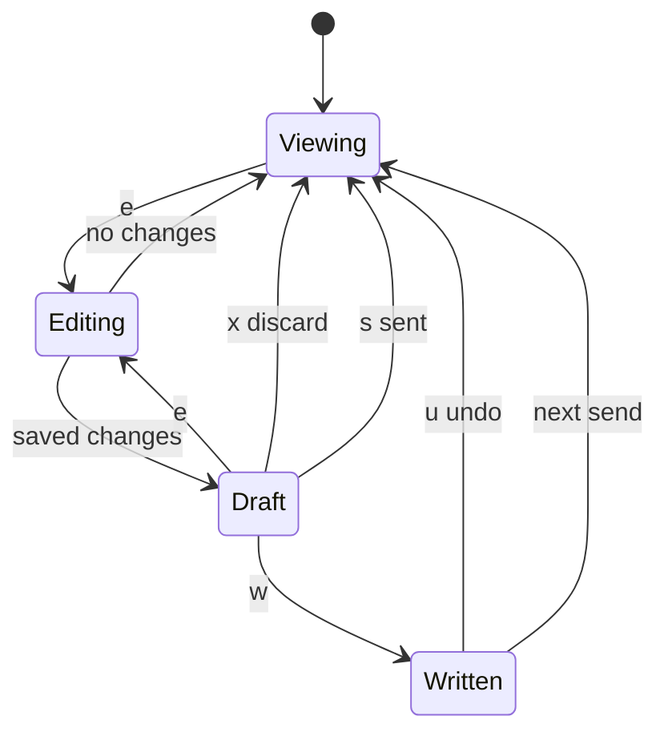

# Blueprint edit mode: design

Date: 2026-10-10. Status: draft for review.

## Goal

Let the person correct what Blueprint shows, a doc or a diagram, in their own
editor, see what changed, and hand that change to the agent next to Blueprint.

## Rules

These come from the discussion and bind the rest of this document.

1. Reading stays as it is: rendered Markdown and drawn Mermaid. Editing is a
   separate mode, entered with `e`.
2. Editing happens in a draft. The original file is not touched until the
   person writes the draft with `w`.
3. `s` sends the change to the agent as a diff. Blueprint does not write the
   file on `s`: the agent is the only one writing, so the two never collide.
4. `u` undoes a `w`, but only while the file still holds what Blueprint wrote.
   If anything changed it since (usually the agent), `u` refuses.
5. Blueprint never starts an agent on its own. It asks first.
6. Nothing new outlives the session. The draft lives in a temporary file that
   is deleted when the draft ends (a long diff handed to the agent, when
   Blueprint closes). Only a `w` changes anything on disk, and
   only the file being edited.

Two of these touch the locked v1 rule ("A send or a requested refresh replaces
the screen. ... Nothing but the theme is kept."); see "Changes to the locked
rule" below.

## States



- **Viewing**: today's viewer.
- **Editing**: the editor runs in the Blueprint pane; Blueprint is suspended.
- **Draft**: Blueprint shows the draft, rendered like the original, with the
  changes counted in the header (`Draft · 3 changes`) and the draft keys in the
  footer.
- **Written**: the draft is in the file. `u` is offered until the screen is
  replaced.

## The editor

- Command: `$VISUAL`, then `$EDITOR`, then the first of `vim`, `vi`, `nano`
  found on PATH; on Windows `notepad` as the last resort.
- Run with Textual's `App.suspend()`, which hands the terminal to the editor
  and takes it back afterwards. Textual supports this on Unix and Windows.
- The editor opens a temporary copy named like the original (`login-flow.md`,
  `flow.mmd`) so syntax highlighting works.
- No editor found, or suspend unsupported: a warning in the header, still
  Viewing.
- Saved text equal to the original: back to Viewing with "No changes".

## What can be edited

| On screen | Draft starts from | `w` |
|---|---|---|
| A file (`show`, or picked with `o`) | the file as it is now on disk, read at `e` | yes |
| Text or Mermaid an agent sent | the sent source | no: there is no file |
| A file cut by the 1 MB limit | not editable ("too large to edit") | no |
| Welcome or start screen | not editable | no |

## Showing changes

- The draft renders with the same draw flag as the original.
- `d` toggles a unified diff of the source, added lines in the theme's success
  color and removed lines in its error color.
- Marking changed nodes inside a drawn diagram is out of scope for now: termaid
  styles nodes by class, but finding which nodes changed means parsing Mermaid.

## Sending (`s`)

1. Look at the pane next to Blueprint again (as `a` does).
2. A one-line note opens, prefilled with "Apply these changes"; Enter sends,
   Esc goes back to the draft.
3. Blueprint sends through `herdr agent prompt`:

   ```text
   I edited docs/login-flow.md in Blueprint. <note>
   The file on disk is unchanged; apply the change to it and to anything that
   depends on it. Diff:
   <unified diff>
   ```

   For sent text with no file: "I edited the diagram you sent ('<title>')" and
   the new source instead of a path.
4. A diff longer than 6,000 characters goes into a temporary file, and the
   prompt names its path instead of including it. The agent reads it later,
   so this file stays until Blueprint closes.
5. After sending, the screen keeps the draft with "Sent to claude" in the
   header until the agent sends something new.
6. If sending fails (agent waiting for an answer, gone), the draft stays, with
   the reason in the header. Nothing is lost.

### No agent next to Blueprint

- **The neighbor is a shell at its prompt**: a dialog asks "Start an agent next
  to Blueprint?" with the agent kinds found on PATH (claude, codex, ...),
  claude first when present. On Enter, Blueprint runs
  `herdr agent start <kind>-<pane> --kind <kind> --pane <id>`, waits for it to
  be ready (30 s), then sends.
- **No neighbor, or it runs something else**: a warning, "Open an agent next to
  Blueprint, then press s again". Opening a new pane for the agent is out of
  scope for now: `herdr pane split` only goes right or down from a pane, which
  would put the agent on the wrong side of Blueprint.

## Writing (`w`) and undo (`u`)

- `w` writes the draft into the file, but only if the file still holds what the
  draft started from. If it changed while the person was editing, `w` refuses
  ("the file changed while you were editing; send it with s instead").
- Before writing, Blueprint keeps the old text in memory. `u` puts it back if
  the file still holds exactly what Blueprint wrote; otherwise it refuses.
- The undo is gone once the screen is replaced, or Blueprint closes.

## Sends that arrive during a draft

A send replacing the screen would throw away the person's edit. While a draft
or a send note is open, an incoming send waits; the header says "new send
waiting". When the draft ends (`s`, `w` or `x`), the newest waiting send is
shown, as if it had just arrived. Refreshes asked for during a draft are
dropped.

## Changes to the locked rule

- "A send ... replaces the screen" gains one exception: not while the person
  holds a draft. The send is delayed, not lost.
- "Nothing but the theme is kept" still holds. The draft file is temporary and
  `w` writes only the document the person chose to change. Remembering the last
  agent kind would break this rule, so the agent dialog does not remember it.

## Keys

| Key | When | Action |
|---|---|---|
| `e` | viewing an editable item, or in a draft | edit |
| `s` | draft | send the change to the agent |
| `w` | draft of a file | write the draft into the file |
| `x` | draft | discard the draft |
| `d` | draft | show or hide the diff |
| `u` | after `w` | undo the write |

None of these are taken today (`hjkl`, `g`, `G`, `ctrl+d`, `ctrl+u`, `a`, `o`,
`t`, `r`, `q`).

## Parts

- `edit.py` (new): `Draft` (original text, draft text, path or title, base
  text for the `w` check), `diff_text()`, `change_count()`, `editor_command()`,
  `prompt_for(draft, note)`. No Textual, so it is tested on its own.
- `sources/pane.py`: `agent_kinds_on_path()`, `start_agent(herdr, source,
  kind)` next to `ask_to_draw`, and `send_prompt(herdr, source, text)` shared
  with `a`.
- `app.py`: the edit actions, the waiting send, the header and footer for the
  draft. The editor and herdr calls are injected so tests run without them.
- `start.py` (or a new `dialogs.py`): the send-note input and the agent dialog.

## Testing

- `edit.py`: diff and change count, prompt text for files and for sent text,
  the 6,000-character switch to a file, editor command resolution (env vars,
  PATH, Windows fallback).
- App, with a fake editor that rewrites the temp file: `e` with no change, `e`
  into a draft, `x`, `w` writing the file, `w` refused after the file changed,
  `u` restoring and `u` refused, `d` toggling, `s` with a fake asker, a send
  arriving during a draft and shown after `x`.
- Agent start: the `herdr agent start` arguments, the shell case, the no-pane
  case, kinds found on PATH.
- Live, in the isolated demo herdr: real vim driven with `herdr pane send-keys`,
  then `s` to a real Claude Code.

## Open questions

- None blocking. Splitting a pane for an agent, changed-node marking and
  remembering the agent kind are left for later on purpose.
