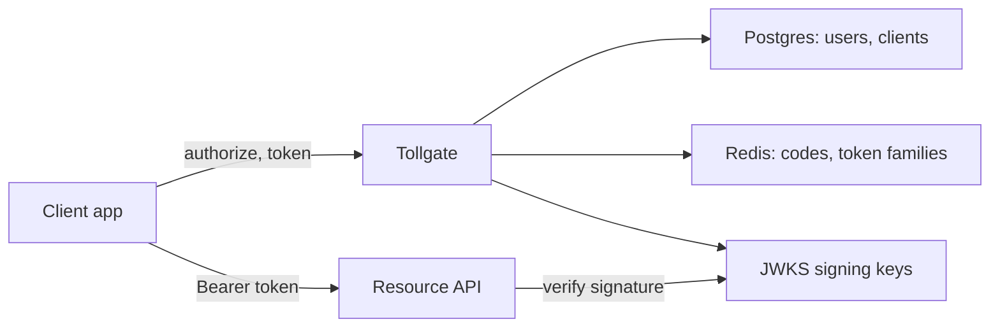

# Architecture

Tollgate sits between client apps and the people who use them. Resource APIs
never call Tollgate on each request: they check token signatures against the
published JWKS keys.

| Part | Job |
|---|---|
| `src/routes/login.ts` | Signs people in with email and password, starts a session |
| `src/session.ts` | Session cookie backed by Redis, 8 hours |
| `src/routes/authorize.ts` | Checks the client and redirect URI, issues a one-time code |
| `src/routes/token.ts` | Trades a code or refresh token for new tokens |
| `src/tokens.ts` | Signs access tokens, rotates refresh token families |
| `src/store.ts` | Postgres pool and Redis helpers |
