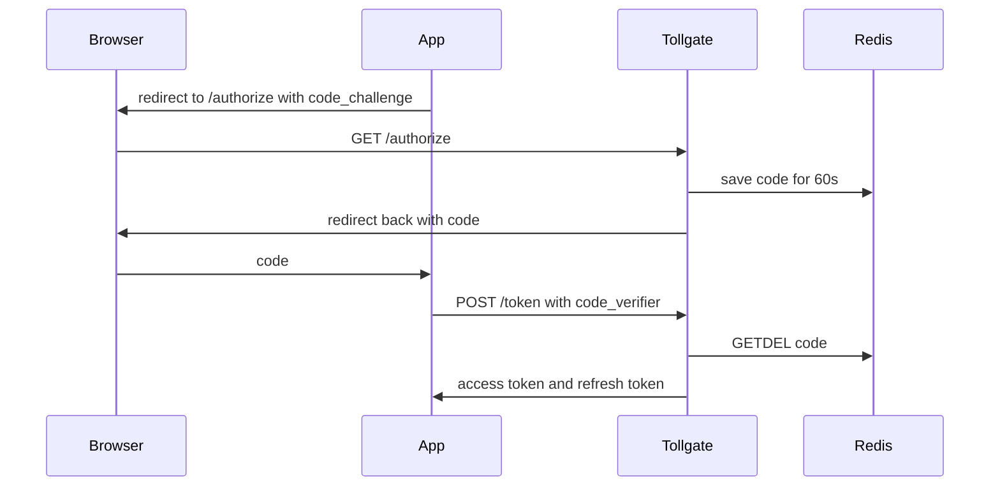

# Login flow

Authorization code with PKCE. The app never sees the password, and a stolen
code is useless without the verifier that only the app holds.

```mermaid
sequenceDiagram
  participant B as Browser
  participant A as App
  participant T as Tollgate
  participant R as Redis
  A->>B: redirect to /authorize with code_challenge
  B->>T: GET /authorize
  T->>R: save code for 60s
  T->>B: redirect back with code
  B->>A: code
  A->>T: POST /token with code_verifier
  T->>R: GETDEL code
  T->>A: access token and refresh token
```
