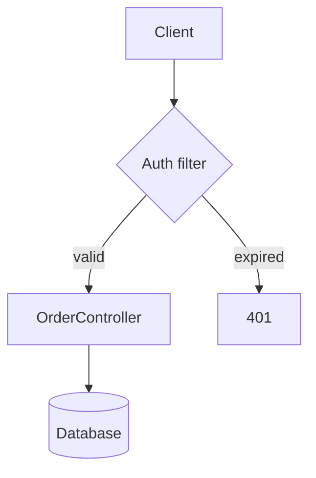

# Order flow

The API checks the token, stores the order and publishes an event.


```mermaid
graph TD
  A[Client] --> B{Auth filter}
  B -->|valid| C[OrderController]
  B -->|expired| D[401]
  C --> E[(Database)]
```

| Step | Owner |
|---|---|
| Auth | Gateway |
| Save | OrderService |

```python
order_service.place(order)
```
