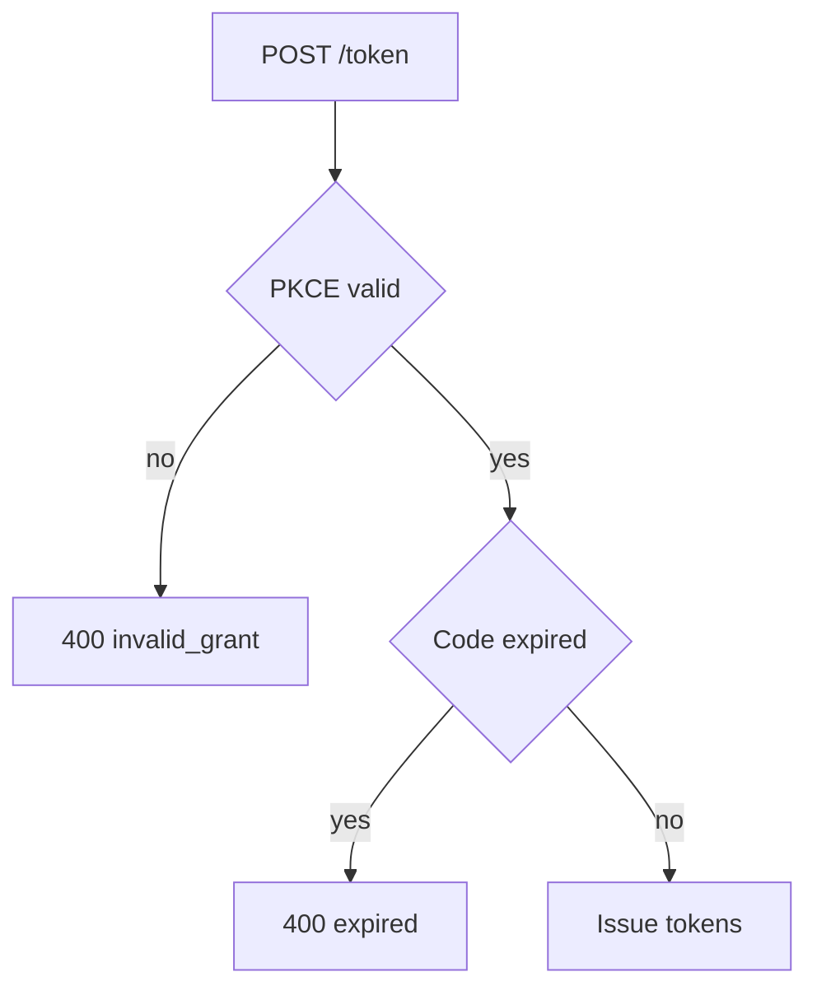

# Token endpoint

Exchanges an authorization code for tokens. Point at a box and say what should change.

```mermaid
flowchart TD
  R[POST /token] --> V{PKCE valid}
  V -->|no| E[400 invalid_grant]
  V -->|yes| X{Code expired}
  X -->|yes| G[400 expired]
  X -->|no| I[Issue tokens]
  %% Blueprint: the code each box stands for (not drawn)
  %% code: R src/routes/token.ts:20
  %% code: V src/auth/pkce.ts:10
  %% code: X src/auth/codes.ts:31
  %% code: I src/auth/tokens.ts:12
```
